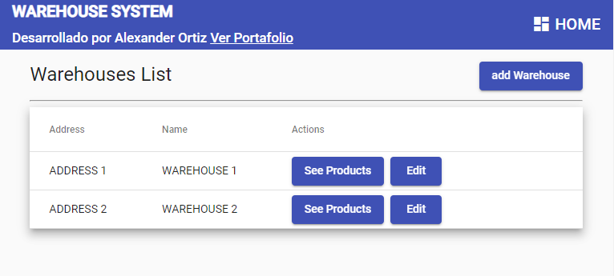
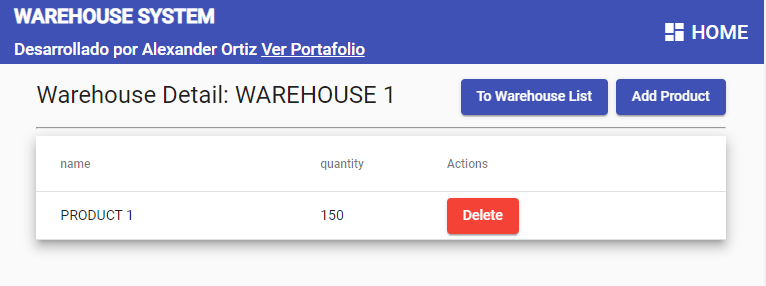

# Control de Almacen

- Requeriments : 
    - MongoDB
    - Nest CLI
    - Angular CLI

RUN BACKEND

<code>cd warehose-backend</code>  
<code>npm i</code>  
<code>npm run start:dev</code>  

RUN FRONTEND

<code>cd warehouse-frontend</code>  
<code>npm i</code>  
<code>ng serve -o</code>  